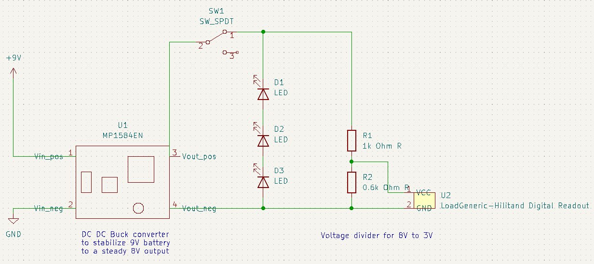

Lightweight and compact , easily extendible, with foot pedal integrated LED and digital readout for easy and accurate hole drilling in wood, plastic, soft metals... plan on adding a clamping system as well. 

## Introduction and Relevant Links
Power should have twisted cables. Power needed is a 9.6V 3A Supply.
Other Power, for led, LDO, and potential blower all supplied with a LiPolymer 9V battery. 

## BOM
See bom

## CAD Files
Onshape link in progress, so far have only covered the dehumidifier opening mechanism
 [Link](https://cad.onshape.com/documents/13fd21aea535904a6b5f1962/w/cf074e89e8c63fae2da52691/e/0422817288bd131f1018f0b8)

## Gerber (PCB) Files
KiCad file name is 031323-DSAND... wrote it wrong
  To be completed, want to confirm that the voltage divider works for the DRO without too much heat dissipation.

## Descriptions??

## Results and Improvements
